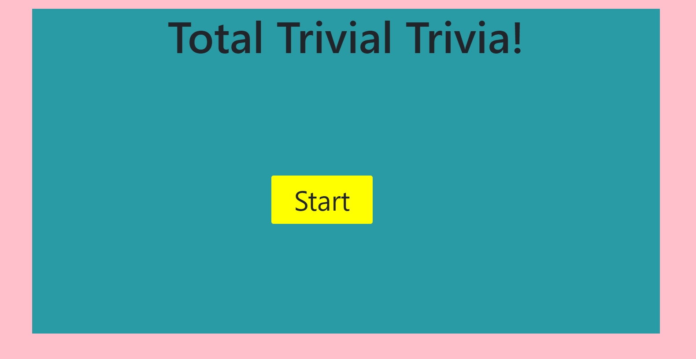
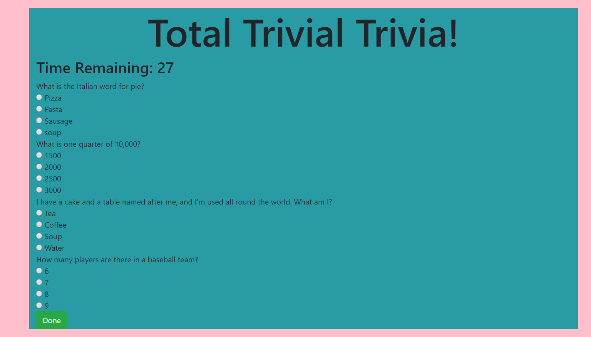

# TriviaGame

### Technologys I was using in this project
- HTML
- JS
- CSS

### Steps for finished this project
- First I set the timer to 30 seconds
- I used show/hide function

```js
$("#gameContainer").hide();
$("#finishContainer").hide();

$("#startButton").on("click", function() {
  console.log("button clicked");
  $("#startButton").hide();
  $("#finishContainer").hide();
  
  $("#gameContainer").show();
  $("#timeRemaining").text(displayTime);
});
```
- When click the Done button, it will goes to the next page showing the score

### preview of the game:

